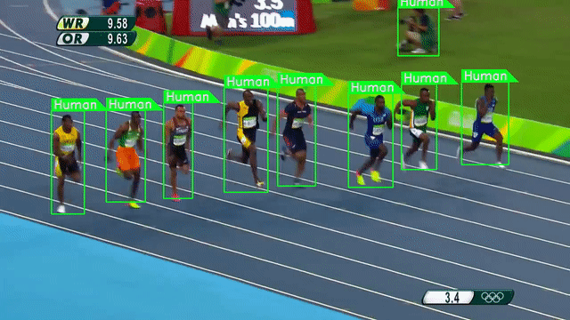

# Human detection in video streams using a pre-trained YOLOv3 in Pytorch 

A pre-trained YOLOv3 is used to detect humans(/presence of humans)  in a video stream.
This code can be adapted for detecting one or multiple objects in a video stream. After that, The video can be trimmed to a shorter one by avoiding all the frames that do not contain the specified objects and the audio is restituted and mixed to the resulted video.

## Installation and use
**Clone the repository:**
git clone https://github.com/hocinilotfi/Human-detection-in-video-streams-using-a-pre-trained-YOLOv3-in-Pytorch.git

**Install the required packages:**
pip install requirements.txt

**Using the script**
> python detect_humans.py -i *inputfile* -o *outputfile*

**Example:**
python detect_humans.py   -i   input_video.mp4   -o    output_video.mp4

**References:**

1. YOLOv3: https://pjreddie.com/darknet/yolo/
2. Erik Lindernoren's YOLO implementation: https://github.com/eriklindernoren/PyTorch-YOLOv3
3. YOLO paper: https://pjreddie.com/media/files/papers/YOLOv3.pdf
   
   
   

   

